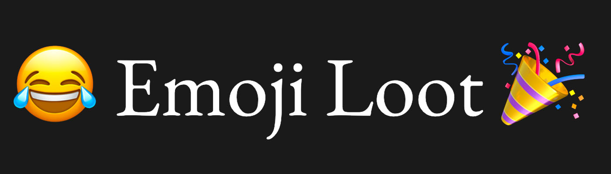

Website: [emloot.xyz](https://emloot.xyz)

A derivative of [Loot project](https://www.lootproject.com/).
Emojis are more abstract but more expressive.
Find an emLoot to represent your lifestyle in the upcoming metaverse.

Frequently Asked Questions
What is emLoot?
emLoot is a collection of 8,000 unique NFT tokens that use emojis to represent your lifestyle in the metaverse. See Loot project for more information.

Just like Loot, emLoot is an unaudited project. Bags #1 to #7777 are claimable by anyone and #7778 to #8000 are currently reserved for the contract deployer.

How to get emLoot?
You can mint emLoot straight out of the [contract on Etherscan](https://etherscan.io/address/0x4335541d17f6344c29f2412e520ed71639150ead#writeContract).

Just go to [Write Contract] tab on ehterscan and find [claim] method. Connect your wallet and enter your lucky number in the [tokenId] field. Then hit [Write].

Feel free to sell your tokens on [OpenSea](https://opensea.io/).

